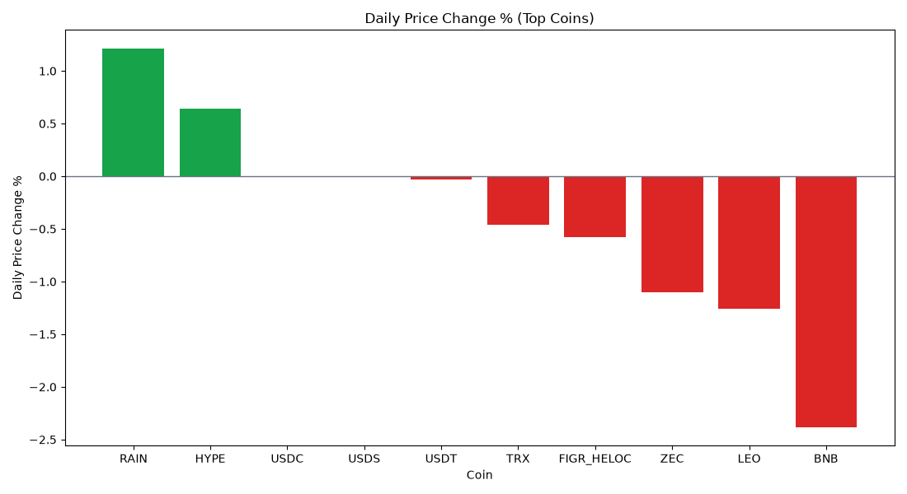
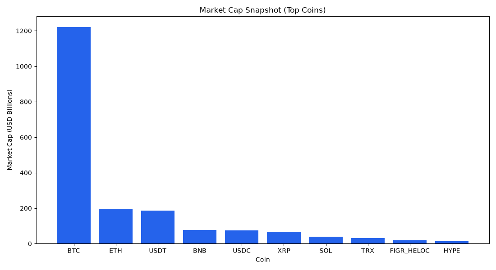

# PySpark-ETL-and-Analysis-on-Trending-Crypto-Prices

Daily ETL and trend analysis project for top cryptocurrencies using Python, PySpark, and GitHub Actions.

## What this project does

- Pulls the latest top crypto market data from CoinGecko.
- Stores both the latest snapshot and a daily history CSV.
- Runs a PySpark ETL job to compute day-over-day trend metrics.
- Generates daily charts and a trend summary report.
- Auto-updates this `README.md` and commits changes from GitHub Actions on a schedule.

## Project structure

- `fetch_crypto_data.py`: Download and persist the latest and historical data.
- `pyspark_etl.py`: Compute trend metrics in PySpark.
- `analysis/exploratory_analysis.py`: Build charts and daily summary artifacts.
- `update_readme.py`: Inject latest metrics/charts/table into the README.
- `pipeline.py`: Orchestrate all steps end-to-end.
- `.github/workflows/daily_pipeline.yml`: Daily automated run and commit.

## Quick start (local)

```bash
python -m pip install -r requirements.txt
python pipeline.py
```

If you already have data and only want to re-run ETL/analysis:

```bash
python pipeline.py --skip-fetch
```

## Automated daily updates (GitHub Actions)

The workflow runs daily and can also be triggered manually.
It updates:

- `data/crypto_prices.csv`
- `data/crypto_prices_history.csv`
- `output/trends_report.csv`
- `output/latest_trends.csv`
- `artifacts/charts/*.png`
- `artifacts/reports/daily_summary.*`
- `README.md`

<!-- AUTO-GENERATED-SECTION:START -->
## Latest Automated Update


- Pipeline run time: **2026-06-25 01:59 UTC**
- Snapshot date: **2026-06-25**
- Coins tracked: **15**
- Avg daily price change: **-1.41%**

- Top gainer: **RAIN (1.21%)**
- Top loser: **DOGE (-4.21%)**

### Trend Charts





### Top Coins Snapshot

| Coin | Symbol | Price | Daily Change | Trend |
|---|---:|---:|---:|---|
| Bitcoin | BTC | $60,871.0000 | -3.24% | Bearish |
| Ethereum | ETH | $1,619.7800 | -3.18% | Bearish |
| Tether | USDT | $0.9985 | -0.03% | Sideways |
| BNB | BNB | $565.5700 | -2.38% | Bearish |
| USDC | USDC | $0.9997 | -0.01% | Sideways |
| XRP | XRP | $1.0740 | -3.24% | Bearish |
| Solana | SOL | $67.8500 | -3.28% | Bearish |
| TRON | TRX | $0.3271 | -0.46% | Sideways |
| Figure Heloc | FIGR_HELOC | $1.0270 | -0.58% | Sideways |
| Hyperliquid | HYPE | $63.2800 | 0.64% | Sideways |

<!-- AUTO-GENERATED-SECTION:END -->
