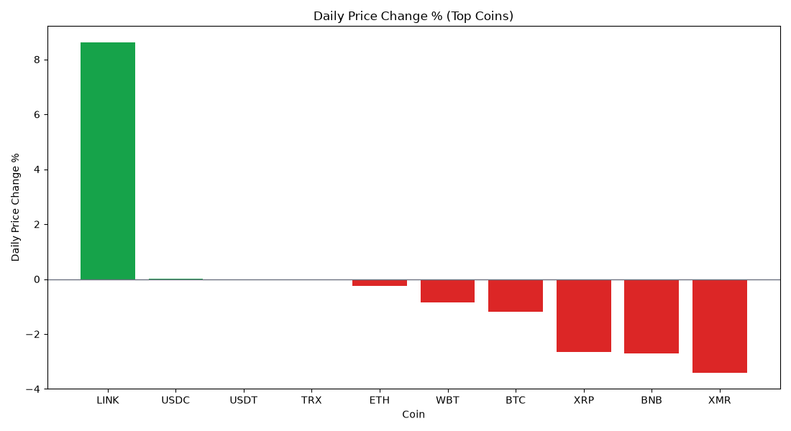
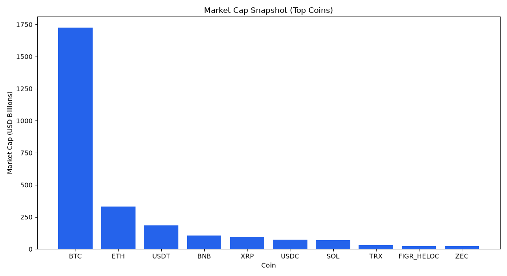

# PySpark-ETL-and-Analysis-on-Trending-Crypto-Prices

Daily ETL and trend analysis project for top cryptocurrencies using Python, PySpark, and GitHub Actions.

## What this project does

- Pulls the latest top crypto market data from CoinGecko.
- Stores both the latest snapshot and a daily history CSV.
- Runs a PySpark ETL job to compute day-over-day trend metrics.
- Generates daily charts and a trend summary report.
- Auto-updates this `README.md` and commits changes from GitHub Actions on a schedule.

## Project structure

- `fetch_crypto_data.py`: Download and persist the latest and historical data.
- `pyspark_etl.py`: Compute trend metrics in PySpark.
- `analysis/exploratory_analysis.py`: Build charts and daily summary artifacts.
- `update_readme.py`: Inject latest metrics/charts/table into the README.
- `pipeline.py`: Orchestrate all steps end-to-end.
- `.github/workflows/daily_pipeline.yml`: Daily automated run and commit.

## Quick start (local)

```bash
python -m pip install -r requirements.txt
python pipeline.py
```

If you already have data and only want to re-run ETL/analysis:

```bash
python pipeline.py --skip-fetch
```

## Automated daily updates (GitHub Actions)

The workflow runs daily and can also be triggered manually.
It updates:

- `data/crypto_prices.csv`
- `data/crypto_prices_history.csv`
- `output/trends_report.csv`
- `output/latest_trends.csv`
- `artifacts/charts/*.png`
- `artifacts/reports/daily_summary.*`
- `README.md`

<!-- AUTO-GENERATED-SECTION:START -->
## Latest Automated Update


- Pipeline run time: **2026-10-01 01:48 UTC**
- Snapshot date: **2026-10-01**
- Coins tracked: **15**
- Avg daily price change: **0.38%**

- Top gainer: **HYPE (3.76%)**
- Top loser: **SOL (-1.01%)**

### Trend Charts





### Top Coins Snapshot

| Coin | Symbol | Price | Daily Change | Trend |
|---|---:|---:|---:|---|
| Bitcoin | BTC | $83,506.0000 | 0.18% | Sideways |
| Ethereum | ETH | $2,687.8400 | 0.69% | Sideways |
| Tether | USDT | $0.9995 | -0.02% | Sideways |
| BNB | BNB | $768.8400 | 1.26% | Bullish |
| XRP | XRP | $1.4900 | -0.67% | Sideways |
| USDC | USDC | $0.9998 | -0.01% | Sideways |
| Solana | SOL | $118.1000 | -1.01% | Bearish |
| TRON | TRX | $0.3377 | 0.95% | Sideways |
| Zcash | ZEC | $1,418.9900 | -0.29% | Sideways |
| Figure Heloc | FIGR_HELOC | $1.0270 | -0.29% | Sideways |

<!-- AUTO-GENERATED-SECTION:END -->
